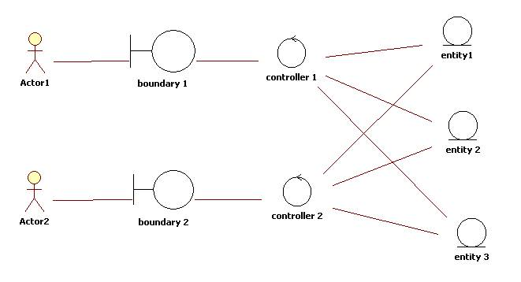
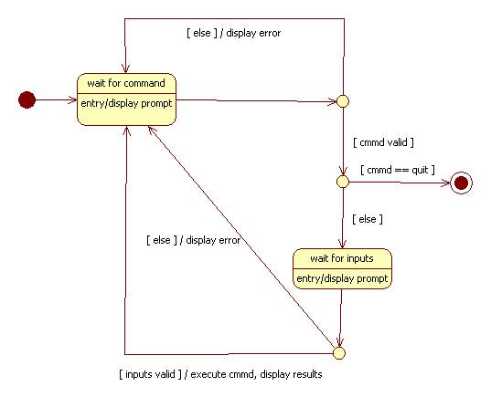
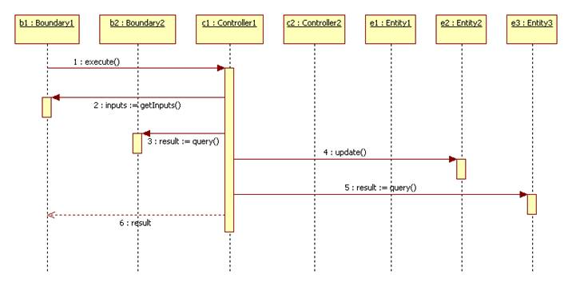
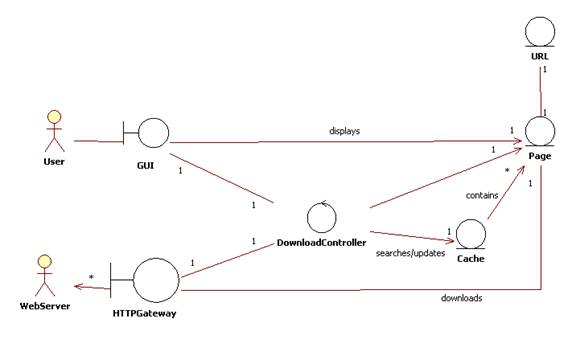
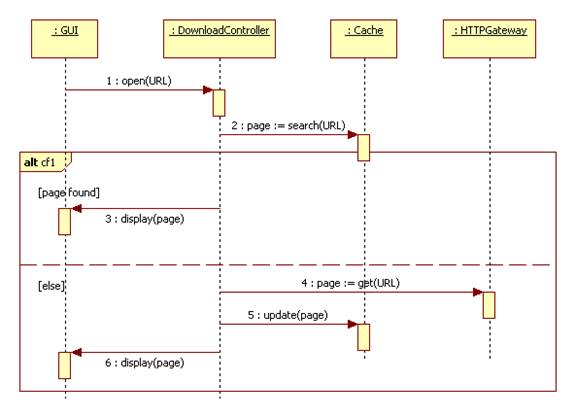
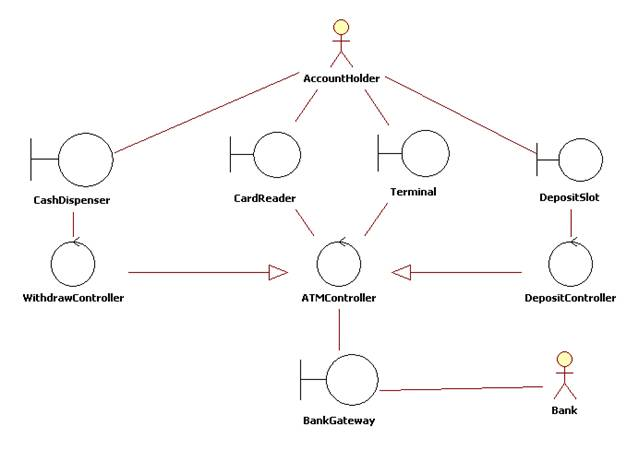
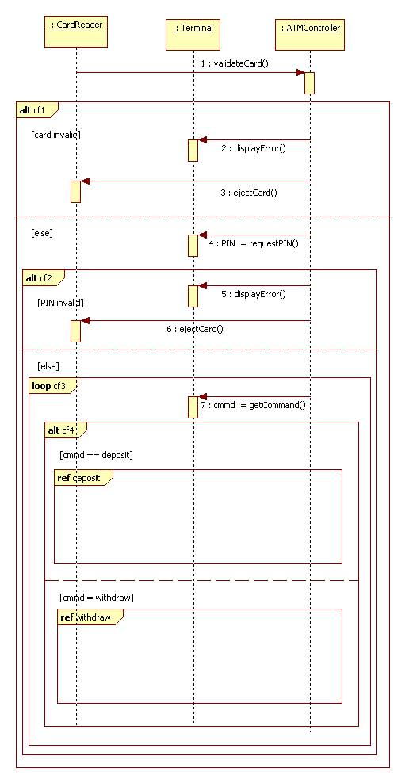
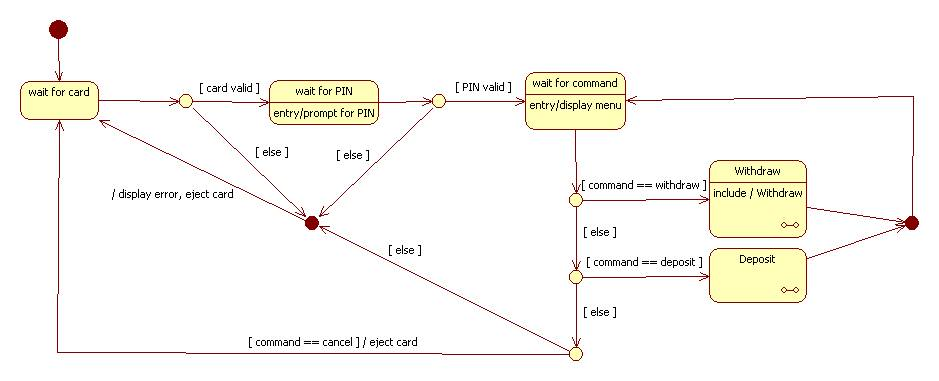
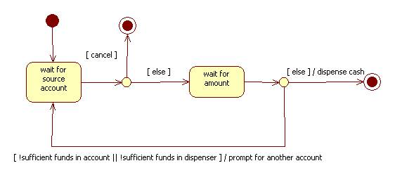
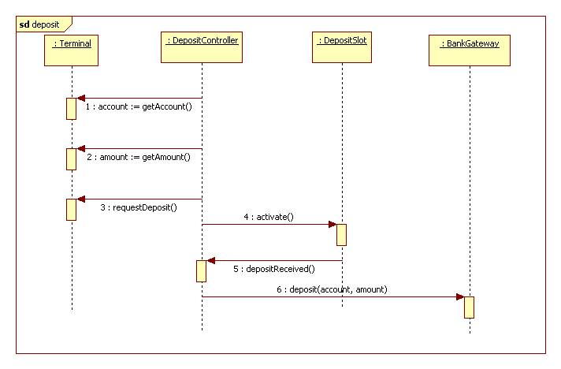

ECB is a simplification of MVC. Here's an example.

**Entities**
Entities are objects representing system data: Customer, Product, Transaction, Cart, etc.

**Boundaries**
Boundaries are objects that interface with system actors: UserInterface, DataBaseGateway, ServerProxy, etc.

**Controls**
Controls are objects that mediate between boundaries and entities. They orchestrate the execution of 
commands coming from the boundary by interacting with entity and boundary objects. Controls often correspond to use cases and map to use case controllers in the design mode.

**Controller internal dynamics**
Associated with every control in the analysis model is a statechart diagram representing the control's internal logic.

For example, the figure below.

**External dynamics**
Associated with every control is a sequence diagram representing the control's interactions with boundaries, entities, and other controls.

Me: These charts seem to be state diagrams.

For example, the figure below.

## Webpage example

## ATM example

