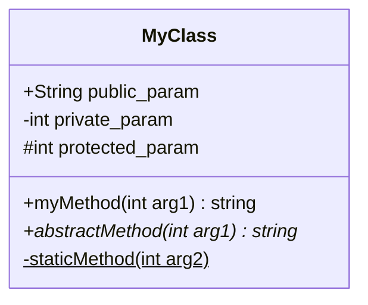

```mermaid
%% The basic diagram is as follows:

%% Needs to be present to define diagram type
classDiagram    
    class MyClass{
        +String public_param
        -int private_param
        #int protected_param

        +myMethod(int arg1) string
        +abstractMethod(int arg1)* string
        -staticMethod(int arg2)$
    }

```