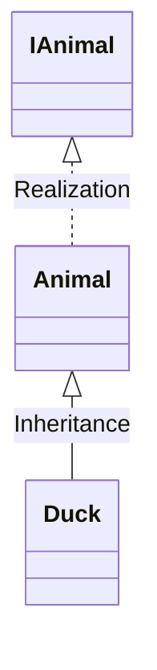

```mermaid
%% In one view, we have:
%%      Type	Description
%%      <|--	Inheritance
%%      *--	    Composition
%%      o--	    Aggregation
%%      -->	    Association
%%      --	    Link (Solid)
%%      ..>	    Dependency
%%      ..|>	Realization
%%      ..	L   ink (Dashed)

%% We may also label the relationship using :
classDiagram
    Animal <|-- Duck : Inheritance

    IAnimal <|.. Animal : Realization

    class Animal{

    }

    class Duck{

    }

    class IAnimal{

    }
```