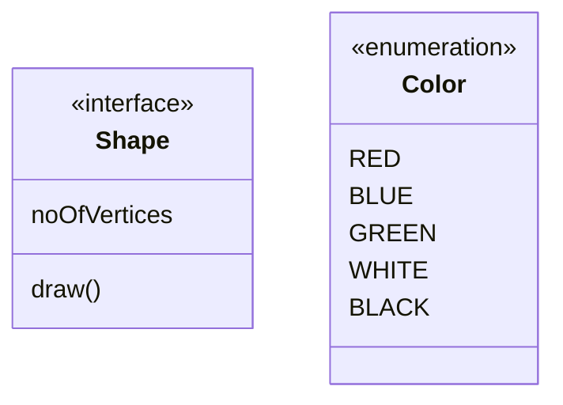

```mermaid
%% <<Interface>> To represent an Interface class
%% <<abstract>> To represent an abstract class
%% <<Service>> To represent a service class
%% <<enumeration>> To represent an enum

classDiagram
class Shape{
    <<interface>>
    noOfVertices
    draw()
}
class Color{
    <<enumeration>>
    RED
    BLUE
    GREEN
    WHITE
    BLACK
}

```