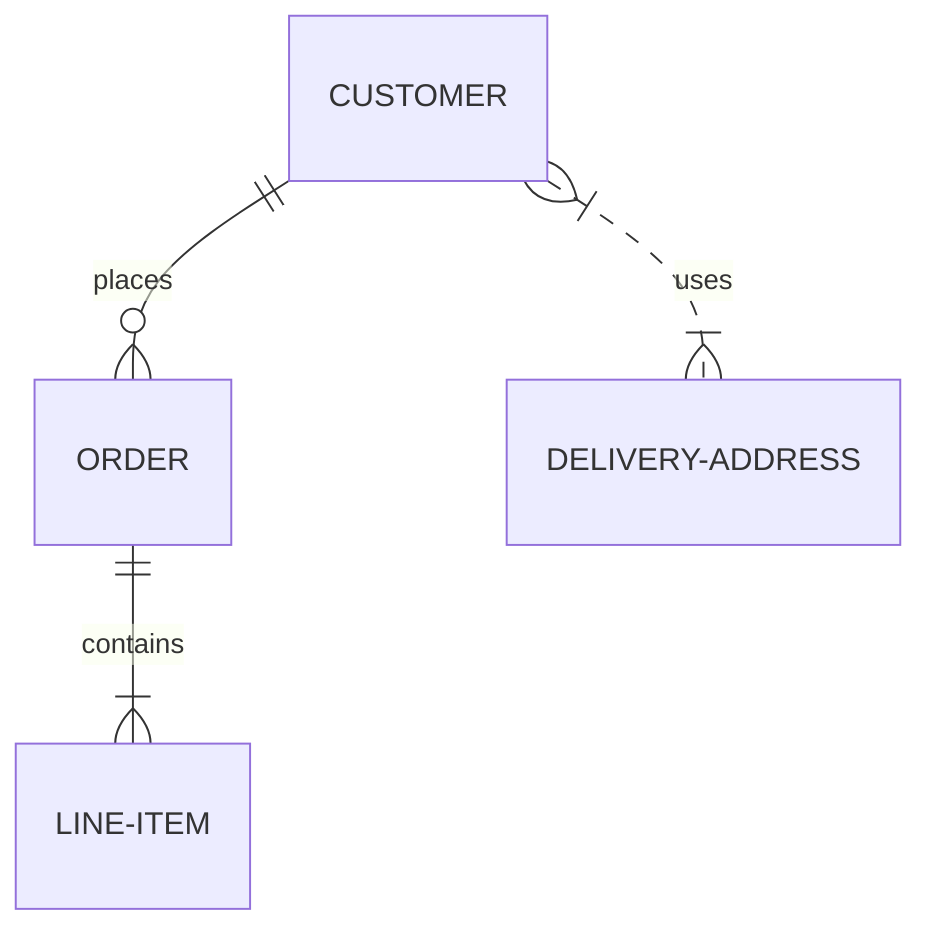

```mermaid
erDiagram
%% Mermaid uses the most popular crow's foot notation. 
%% The relationship part of each statement can be broken down into three sub-components:

%% the cardinality of the first entity with respect to the second,
%% whether the relationship confers identity on a 'child' entity
%% the cardinality of the second entity with respect to the first

%% Cardinality is a property that describes how many elements of another entity can be related to the entity in question

%% We have:
%%      Value (left)	Value (right)	Meaning
%%          |o	            o|	        Zero or one
%%          ||	            ||	        Exactly one
%%          }o	            o{	        Zero or more (no upper limit)
%%          }|	            |{	One or more (no upper limit)

%% Example: PROPERTY ||--|{ ROOM : contains 
%% A proprty can have one or many rooms, but a room belongs to one and only one property. So what is on the other side indicates how many of it the left side would have.

    CUSTOMER ||--o{ ORDER : places
    ORDER ||--|{ LINE-ITEM : contains
    CUSTOMER }|..|{ DELIVERY-ADDRESS : uses
```