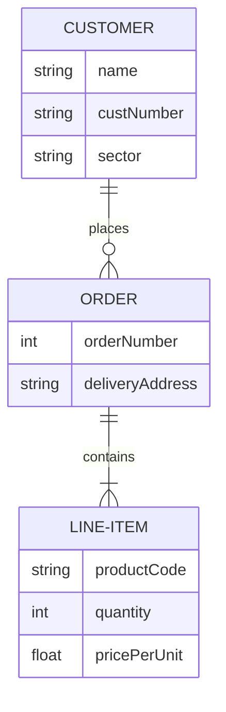

```mermaid
erDiagram
%% When including attributes on ER diagrams, you must decide whether to include foreign keys as attributes. 

   CUSTOMER ||--o{ ORDER : places
   ORDER ||--|{ LINE-ITEM : contains

    CUSTOMER {
        string name
        string custNumber
        string sector
    }
    ORDER {
        int orderNumber
        string deliveryAddress
    }
    LINE-ITEM {
        string productCode
        int quantity
        float pricePerUnit
    }
```