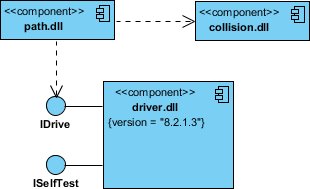

Me: Essentially, these are the interface implementation pairs for each module of the code.

A component diagram depicts how components are wired together to form larger components or software systems. It illustrates the architectures of the software components and the dependencies between them. Those software components including run-time components, executable components also the source code components.

A component diagram breaks down the actual system under development into various high levels of functionality. Each component is responsible for one clear aim within the entire system and only interacts with other essential elements on a need-to-know basis.

Here's a detail of each component:

-   The data (account and inspection ID) flows into the component via the port on the right-hand side and is converted into a format the internal components can use. The interfaces on the right are known as required interfaces, which represents the services the component needed in order to carry out its duty.
-   The data then passes to and through several other components via various connections before it is output at the ports on the left. Those interfaces on the left are known as provided interface, which represents the services to deliver by the exhibiting component.
-   It is important to note that the internal components are surrounded by a large 'box' which can be the overall system itself (in which case there would not be a component symbol in the top right corner) or a subsystem or component of the overall system (in this case the 'box' is a component itself).

## Basic concepts of the diagram
A component represents a modular part of a system that encapsulates its contents and whose manifestation is replaceable within its environment. In UML 2, a component is drawn as a rectangle with optional compartments stacked vertically. A high-level, abstracted view of a component in UML 2 can be modeled as:

-   A rectangle with the component's name
-   A rectangle with the component icon
-   A rectangle with the stereotype text and/or icon

## Interface
The example below shows two type of component interfaces:

Provided interface symbols with a complete circle at their end represent an interface that the component provides - this "lollipop" symbol is shorthand for a realization relationship of an interface classifier.

Required Interface symbols with only a half circle at their end (a.k.a. sockets) represent an interface that the component requires (in both cases, the interface's name is placed near the interface symbol itself).

Me: The part with the arc implies that the interface is needed, and the part with the circle shows the component provides (implements) the interface.

## Subsytems
The subsystem classifier is a specialized version of a component classifier. Because of this, the subsystem notation element inherits all the same rules as the component notation element. The only difference is that a subsystem notation element has the keyword of subsystem instead of component.

## Port
Ports are represented using a square along the edge of the system or a component. A port is often used to help expose required and provided interfaces of a component.

## Relationships
Me: These relationships are shown exactly like association, generalization, composition, aggregeation, etc, in a class diagram.

Association: An association specifies a semantic relationship that can occur between typed instances. It has at least two ends represented by properties, each of which is connected to the type of the end. More than one end of the association may have the same type.

Composition: Composite aggregation is a strong form of aggregation that requires a part instance be included in at most one composite at a time. If a composite is deleted, all of its parts are normally deleted with it.

Aggregation: A kind of association that has one of its end marked shared as kind of aggregation, meaning that it has a shared aggregation. 

Constraint: A condition or restriction expressed in natural language text or in a machine readable language for the purpose of declaring some of the semantics of an element.
Component 

Dependency: A dependency is a relationship that signifies that a single or a set of model elements requires other model elements for their specification or implementation.
This means that the complete semantics of the depending elements is either semantically or structurally dependent on the definition of the supplier element(s).

Links: A generalization is a taxonomic relationship between a more general classifier and a more specific classifier.
Each instance of the specific classifier is also an indirect instance of the general classifier. Thus, the specific classifier inherits the features of the more general classifier.

## Source code modeling
Either by forward or reverse engineering, identify the set of source code files of interest and model them as components stereotyped as files.

For larger systems, use packages to show groups of source code files.

Consider exposing a tagged value indicating such information as the version number of the source code file, its author, and the date it was last changed. Use tools to manage the value of this tag.

Model the compilation dependencies among these files using dependencies. Again, use tools to help generate and manage these dependencies.

## Modeling an Executable Release
Identify the set of components you'd like to model. Typically, this will involve some or all the components that live on one node, or the distribution of these sets of components across all the nodes in the system.

Consider the stereotype of each component in this set. For most systems, you'll find a small number of different kinds of components (such as executables, libraries, tables, files, and documents). You can use the UML's extensibility mechanisms to provide visual cues(clues) for these stereotypes.

For each component in this set, consider its relationship to its neighbors. Most often, this will involve interfaces that are exported (realized) by certain components and then imported (used) by others. If you want to expose the seams in your system, model these interfaces explicitly. If you want your model at a higher level of abstraction, elide these relationships by showing only dependencies among the components.

