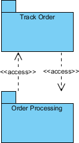

Package diagram is used to simplify complex class diagrams, you can group classes into packages. A package is a collection of logically related UML elements.

The diagram below is a business model in which the classes are grouped into packages:

Packages appear as rectangles with small tabs at the top. The package name is on the tab or inside the rectangle. The dotted arrows are dependencies. One package depends on another if changes in the other could possibly force changes in the first.

Show modules need to access one another with the access tick

