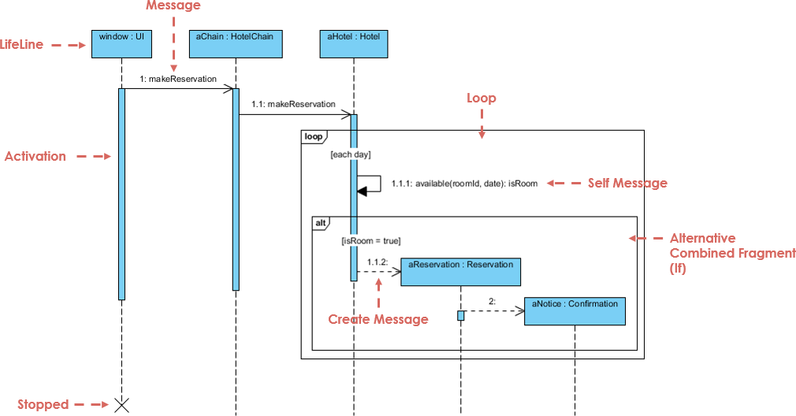
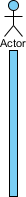

UML Sequence Diagrams are interaction diagrams that detail how operations are carried out. They capture the interaction between objects in the context of a collaboration. Sequence Diagrams are time focus and they show the order of the interaction visually by using the vertical axis of the diagram to represent what messages are sent and when.

Sequence Diagrams captures:

-   the interaction that takes place in a collaboration that either realizes a use case or an operation (instance diagrams or generic diagrams)
-   high-level interactions between user of the system and the system, between the system and other systems, or between subsystems (sometimes known as system sequence diagrams)

**Purpose of Sequence Diagram**
-   Model high-level interaction between active objects in a system
-   Model the interaction between object instances within a collaboration that realizes a use case
-   Model the interaction between objects within a collaboration that realizes an operation
-   Either model generic interactions (showing all possible paths through the interaction) or specific instances of a interaction (showing just one path through the interaction)

## Sequence Diagrams at a Glance
Sequence Diagrams show elements as they interact over time and they are organized according to object (horizontally) and time (vertically):

**Object Dimension**
The horizontal axis shows the elements that are involved in the interaction
Conventionally, the objects involved in the operation are listed from left to right according to when they take part in the message sequence. However, the elements on the horizontal axis may appear in any order

**Time Dimension**
The vertical axis represents time proceedings (or progressing) down the page.
Note that:

Time in a sequence diagram is all a about ordering, not duration. The vertical space in an interaction diagram is not relevant for the duration of the interaction.

## Example of a hotel
Sequence Diagram is an interaction diagram that details how operations are carried out -- what messages are sent and when. Sequence diagrams are organized according to time. The time progresses as you go down the page. The objects involved in the operation are listed from left to right according to when they take part in the message sequence.

Below is a sequence diagram for making a hotel reservation. The object initiating the sequence of messages is a Reservation window.

## Participants

**Actor**

- type of role played by an entity that interacts with the subject (e.g., by exchanging signals and data) external to the subject (i.e., in the sense that an instance of an actor is not a part of the instance of its corresponding subject). 
- represent roles played by human users, external hardware, or other subjects.
Note that:

    *   An actor does not necessarily represent a specific physical entity but merely a particular role of some entity
    *   A person may play the role of several different actors and, conversely, a given actor may be played by multiple different person.

**Lifeline**

-   A lifeline represents an individual participant in the Interaction

**Activations**

-   A thin rectangle on a lifeline) represents the period during which an element is performing an operation.
-   The top and the bottom of the of the rectangle are aligned with the initiation and the completion time respectively

**Call Message**

A message defines a particular communication between Lifelines of an Interaction.
Call message is a kind of message that represents an invocation of operation of target lifeline.

**Return Message**

A message defines a particular communication between Lifelines of an Interaction.
Return message is a kind of message that represents the pass of information back to the caller of a corresponded former message.

**Self Message**

A message defines a particular communication between Lifelines of an Interaction.
Self message is a kind of message that represents the invocation of message of the same lifeline.

**Recursive Message**

A message defines a particular communication between Lifelines of an Interaction.
Recursive message is a kind of message that represents the invocation of message of the same lifeline. It's target points to an activation on top of the activation where the message was invoked from.

**Create Message**

A message defines a particular communication between Lifelines of an Interaction.
Create message is a kind of message that represents the instantiation of (target) lifeline.

## Combined fragment example

## Search example

