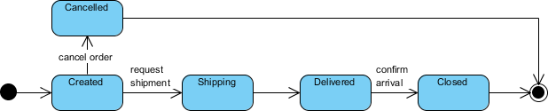

State machine diagram typically are used to describe state-dependent behavior for an object. An object responds differently to the same event depending on what state it is in. State machine diagrams are usually applied to objects but can be applied to any element that has behavior to other entities such as: actors, use cases, methods, subsystems systems and etc. and they are typically used in conjunction with interaction diagrams (usually sequence diagrams).

## Concurrent State
As mentioned above, states in state machine diagrams can be nested. Related states can be grouped together into a single composite state. Nesting states inside others is necessary when an activity involves concurrent sub-activities. The following state machine diagram models an auction with two concurrent substates: processing the bid and authorizing the payment limit.

Concurrent State Machine Diagram Example - Auction Process

In this example, the state machine first entering the Auction requires a fork at the start into two separate start threads. Each substate has an exit state to mark the end of the thread. Unless there is an abnormal exit (Canceled or Rejected), the exit from the composite state occurs when both substates have exited.

