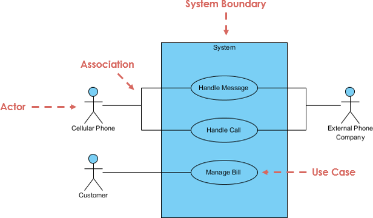
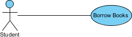
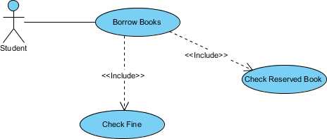
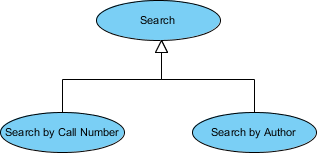

A UML use case diagram is the primary form of system/software requirements for a new software program underdeveloped. Use cases specify the expected behavior (what), and not the exact method of making it happen (how). Use cases once specified can be denoted both textual and visual representation (i.e. use case diagram). A key concept of use case modeling is that it helps us design a system from the end user's perspective. It is an effective technique for communicating system behavior in the user's terms by specifying all externally visible system behavior.

A use case diagram is usually simple. It does not show the detail of the use cases:
-   It only summarizes some of the relationships between use cases, actors, and systems.
-   It does not show the order in which steps are performed to achieve the goals of each use case.

As said, a use case diagram should be simple and contain only a few shapes. If yours contain more than 20 use cases, you are probably misusing use case diagram.

Use cases represent only the functional requirements of a system. Other requirements such as business rules, quality of service requirements, and implementation constraints must be represented separately, again, with other UML diagrams.

## Purpose of Use Case Diagram
Use case diagrams are typically developed in the early stage of development and people often apply use case modeling for the following purposes:

-   Specify the context of a system
-   Capture the requirements of a system
-   Validate a systems architecture
-   Drive implementation and generate test cases
-   Developed by analysts together with domain experts

## Use case diagram as at a glance
A standard form of use case diagram is defined in the Unified Modeling Language as shown in the Use Case Diagram example below:

We have actors (with an ephigy,) use case with ellipses, and systems with a rectangle, together with association lines, each discussed below:

**Actor**
-   Someone interacts with use case (system function).
-   Named by noun.
-   Actor plays a role in the business
-   Similar to the concept of user, but a user can play different roles
-   For example:
    *   A prof. can be instructor and also researcher
    *   plays 2 roles with two systems
    *   Actor triggers use case(s).
    *   Actor has a responsibility toward the system (inputs), and Actor has expectations from the system   (outputs).

**Use Case**
- System function (process - automated or manual)
- Named by verb + Noun (or Noun Phrase).
i.e. Do something
- Each Actor must be linked to a use case, while some use cases may not be linked to actors.

**Communication Link**
- The participation of an actor in a use case is shown by connecting an actor to a use case by a solid link.
- Actors may be connected to use cases by associations, indicating that the actor and the use case communicate with one another using messages.

**Boundary of system**
- The system boundary is potentially the entire system as defined in the requirements document.
- For large and complex systems, each module may be the system boundary. For example, for an ERP system for an organization, each of the modules such as personnel, payroll, accounting, etc. can form a system boundary for use cases specific to each of these business functions.
- The entire system can span all of these modules depicting the overall system boundary

## Structuring Use Case Diagram with Relationships
Use cases share different kinds of relationships. Defining the relationship between two use cases is the decision of the software analysts of the use case diagram. A relationship between two use cases is basically modeling the dependency between the two use cases. The reuse of an existing use case by using different types of relationships reduces the overall effort required in developing a system. Use case relationships are listed as the following:

**Association**

**Extends**

- Indicates that an "Invalid Password" use case may include (subject to specified in the extension) the behavior specified by base use case "Login Account".
- Depict with a directed arrow having a dotted line. The tip of arrowhead points to the base use case and the child use case is connected at the base of the arrow.
- The stereotype "<<extends>>" identifies as an extend relationship

**Include**

- When a use case is depicted as using the functionality of another use case, the relationship between the use cases is named as include or uses relationship.
- A use case includes the functionality described in another use case as a part of its business process flow.
- A uses relationship from base use case to child use case indicates that an instance of the base use case will include the behavior as specified in the child use case.
- An include relationship is depicted with a directed arrow having a dotted line. The tip of arrowhead points to the child use case and the parent use case connected at the base of the arrow.
- The stereotype "<<include>>" identifies the relationship as an include relationship.

**Generalization**

- A generalization relationship is a parent-child relationship between use cases.
- The child use case is an enhancement of the parent use case.
- Generalization is shown as a directed arrow with a triangle arrowhead.
- The child use case is connected at the base of the arrow. The tip of the arrow is connected to the parent use case.

## Modelling a vehicle sales system

The figure below shows a use case diagram example for a vehicle system. As you can see even a system as big as a vehicle sales system contains not more than 10 use cases! That's the beauty of use case modeling.

The use case model also shows the use of extend and include. Besides, there are associations that connect between actors and use cases.

## How to Identify Actor
Often, people find it easiest to start the requirements elicitation process by identifying the actors. The following questions can help you identify the actors of your system (Schneider and Winters - 1998):

-   Who uses the system?
-   Who installs the system?
-   Who starts up the system?
-   Who maintains the system?
-   Who shuts down the system?
-   What other systems use this system?
-   Who gets information from this system?
-   Who provides information to the system?
-   Does anything happen automatically at a present time?

## How to Identify Use Cases?
Identifying the Use Cases, and then the scenario-based elicitation process carries on by asking what externally visible, observable value that each actor desires. The following questions can be asked to identify use cases, once your actors have been identified (Schneider and Winters - 1998):

-   What functions will the actor want from the system?
-   Does the system store information? What actors will create, read, update or delete this information?
-   Does the system need to notify an actor about changes in the internal state?
-   Are there any external events the system must know about? What actor informs the system of those events?

## Use Case Diagram Tips
Always structure and organize the use case diagram from the perspective of actors.
Use cases should start off simple and at the highest view possible. Only then can they be refined and detailed further.
Use case diagrams are based upon functionality and thus should focus on the "what" and not the "how".