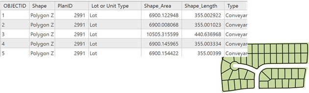

The geodatabase storage model is based on a series of simple yet essential relational database concepts and leverages the strengths of the underlying database management system (DBMS). Simple tables and well-defined attribute types are used to store the schema, rule, base, and spatial attribute data for each geographic dataset. This approach provides a formal model for storing and working with your data. Through this approach, structured query language (SQL) can be used to create, modify, and query tables and their data elements.

You can see how this works by examining how a feature with polygon geometry is modeled in the geodatabase. A feature class is stored as a table, often referred to as the base or business table. Each row in the table represents one feature. The shape column stores the polygon geometry for each feature. The contents of this table, including the shape when stored as a SQL spatial type, can be accessed through SQL.

However, adding spatial types and SQL support for spatial attributes to a DBMS is not enough on its own to support GIS. ArcGIS employs a multitier application architecture by implementing advanced logic and behavior in the application tier on top of the geodatabase storage model. This application logic includes support for a series of generic geographic information system (GIS) data objects and behaviors such as feature classes, raster datasets, topologies, networks, and much more.

## The geodatabase is object relational
The geodatabase is implemented using the same multitier application architecture found in other advanced DBMS applications; there is nothing exotic or unusual about its implementation. The multitier architecture of the geodatabase is sometimes referred to as an object-relational model. The geodatabase objects persist as rows in DBMS tables that have identity, and the behavior is supplied through the geodatabase application logic. The separation of the application logic from the storage is what allows support for several different DBMSs and data formats.

## Geodatabase storage in relational databases
At the core of the geodatabase is a standard relational database schema (a series of standard database tables, column types, indexes, and other database objects). The schema is persisted in a collection of geodatabase system tables in the DBMS that defines the integrity and behavior of the geographic information. These tables are stored either as files on disk or within the contents of a DBMS such as Oracle, IBM DB2, PostgreSQL, or Microsoft SQL Server.

Well-defined column types are used to store traditional tabular attributes. When the geodatabase is stored within a DBMS, spatial representations, most commonly represented by vectors or rasters, are generally stored using a SQL spatial type.

Within the geodatabase, there are two primary sets of tables: system tables and user-defined tables.

-   User-defined tables —Each dataset in the geodatabase is stored in one or more tables. The user-defined tables work with the system tables to manage data.
-   System tables —The geodatabase system tables keep track of the contents of each geodatabase. They essentially describe the geodatabase schema that specifies all dataset definitions, rules, and relationships. These system tables contain and manage all the metadata required to implement geodatabase properties, data validation rules, and behaviors.
The information related to the schema in the geodatabase is stored in four main tables:

    -   GDB_Items: Contains a listing of all items contained within a geodatabase such as feature classes, topologies and domains
    -   GDB_ItemTypes: Contains a predefined list of recognized item types, such as Table
    -   GDB_ItemRelationships: Contains schema associations between items such as which feature classes are contained within a feature dataset
    -   GDB_ItemRelationshipTypes: Contains a predefined list of recognized relationship types such as DatasetInFeatureDataset
The user-defined tables and system tables work together to present and manage the contents of a geodatabase. For example, when viewed in the database, a feature class is simply a table with a spatial column. However, when accessed through ArcGIS, all of the rules stored in the system tables are combined with the underlying data to present it as a feature class with all of the defined behavior

