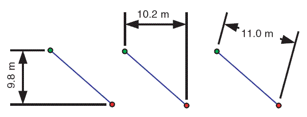
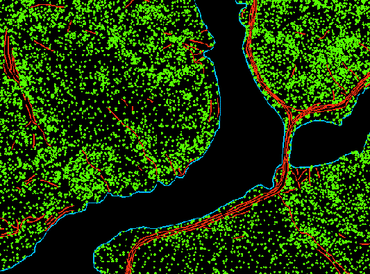

Feature classes are homogeneous collections of common features, each having the same spatial representation—such as points, lines, or polygons—and a common set of attribute columns, for example, a line feature class for representing road centerlines. The four most commonly used feature classes are points, lines, polygons, and annotation (a term for map text).

In the illustration below, these are used to represent four datasets for the same area:

    -   Manhole cover locations as points
    -   Sewer lines
    -   Parcel polygons
    -   Street n-ame annotation

In this diagram, you can also see the potential requirement to model some advanced feature properties. For example, the sewer lines and manhole locations make up a storm sewer network, a system with which you can model runoff and flows. Also, note how adjacent parcels share common boundaries. Most parcel users want to maintain the integrity of shared feature boundaries in their datasets using a topology.

As mentioned earlier, users often need to model such spatial relationships and behaviors in their geographic datasets. In these cases, you can extend these basic feature classes by adding a number of advanced geodatabase elements, such as topologies, network datasets, and terrains.

### Types of feature classes
Vector features (geographic objects with vector geometry) are versatile and frequently used geographic data types, well suited for representing features with discrete boundaries, such as streets, states, and parcels. A feature is an object that stores its geographic representation, which is typically a point, line, or polygon, as one of its properties (or fields) in the row. In ArcGIS, feature classes are homogeneous collections of features with a common spatial representation and set of attributes stored in a database table, for example, a line feature class for representing road centerlines.

When creating a feature class, you are asked to set the type of features to define the type of feature class (point, multipoint, polyline or multipatch).

Me: I don't still understand the difference between a feature class and a layer.

Generally, feature classes are thematic collections of points, lines, or polygons, but there are several feature class types. The first three are supported in databases and geodatabases. The last four are only supported in geodatabases.

    -   Points—Features that are too small to represent as lines or polygons as well as point locations (such as GPS observations).
    -   Lines—Represent the shape and location of geographic objects, such as street centerlines and streams, too narrow to depict as areas. Lines are also used to represent features that have length but no area, such as contour lines and boundaries.
    -   Polygons—A set of many-sided area features that represents the shape and location of homogeneous feature types such as states, counties, parcels, soil types, and land-use zones.
    -   Annotation—Map text including properties for how the text is rendered. For example, in addition to the text string of each annotation, other properties are included such as the shape points for placing the text, its font and point size, and other display properties. Annotation can also be feature linked and can contain subclasses.
    -   Dimensions—A special kind of annotation that shows specific lengths or distances, for example, to indicate the length of a side of a building or land parcel boundary or the distance between two features. Dimensions are heavily used in design, engineering, and facilities applications for GIS.

    -   Multipoints—Features that are composed of more than one point. Multipoints are often used to manage arrays of very large point collections, such as lidar point clusters, which can contain literally billions of points. Using a single row for such point geometry is not feasible. Clustering these into multipoint rows enables the geodatabase to handle massive point sets.

    -   Multipatches—A 3D geometry used to represent the outer surface, or shell, of features that occupy a discrete area or volume in three-dimensional space. Multipatches comprise planar 3D rings and triangles that are used in combination to model a three-dimensional shell. You can use multipatches to represent anything from simple objects, such as spheres and cubes, to complex objects, such as iso-surfaces and buildings.

    -   3D Object—A 3D geometry specialized in representing additional format support, such as materials, along the outer surface or shell of features that occupy a discrete area or volume in three-dimensional space. You can use 3D Objects to represent materials at a high level of detail to support aesthetics such as glossiness or roughness. You can use them on simple or advanced objects, such as spheres and cubes, and complex structures, such as iso-surfaces and building materials. 3D Objects use advanced associated tables to store multiple components for materials. These tables, along with planar 3D rings and triangles, are used in combination to model a three-dimensional shell.

### Feature geometry and feature coordinates
Feature classes contain both the geometric shape of each feature as well as descriptive attributes. Each feature geometry is primarily defined by its feature type (point, line, or polygon). But additional geometric properties can also be defined. For example, features can be single part or multipart, have 3D vertices, have linear measures (called m-values), and contain parametrically defined curves. This section provides a short overview of these capabilities.

#### Single-part and multipart lines and polygons
Line and polygon feature classes can be composed of single parts or multiple parts. For example, a state can contain multiple parts (Hawaii's islands) but is considered to be a single state feature.

#### Vertices, segments, elevation, and measurements
Feature geometry is primarily composed of coordinate vertices. Segments in lines and polygon features span vertices. Segments can be straight edges or parametrically defined curves. Vertices in features can also include z-values to represent elevation measures and m-values to represent measurements along line features.

#### Segment types in line and polygon features
Lines and polygons are defined by two key elements: an ordered list of vertices that define the shape of the line or polygon and the types of line segments used between each pair of vertices. Each line and polygon is an ordered set of vertices that can be connected to form the geometric shape. Another way to express each line and polygon is as an ordered series of connected segments where each segment has a type: straight line, circular arc, elliptical arc, or Bézier curve.

The default segment type is a straight line between two vertices. However, when you need to define curves or parametric shapes, you have three additional segment types that can be defined: circular arcs, elliptical arcs, and Bézier curves. These shapes are often used for representing built environments such as parcel boundaries and roadways.

#### Vertical measurements using z-values
Feature coordinates can include x,y and x,y,z vertices. Z-values are most commonly used to represent elevations, but they can represent other measurements such as annual rainfall or air quality.

Features can have x,y coordinates and, optionally, added z-elevation values.

There are many other properties. See https://pro.arcgis.com/en/pro-app/latest/help/data/geodatabases/overview/feature-class-basics.htm#:~:text=In%20ArcGIS%2C%20feature%20classes%20are,class%20for%20representing%20road%20centerlines.

### Working with feature classes in geodatabase
Option	                Description
Subtypes                You can use subtypes to manage a set of feature subclasses in a single feature class. 
                        This is often used on feature class tables to manage different behaviors on subsets of the same feature type.

Attribute domains       You can use attribute domains to specify a list of valid values or a range of valid values
                        for attribute columns. Use domains to help ensure the integrity of attribute values. Domains are often used to enforce data classifications (such as road class, zoning codes, and land-use classifications).

Versioning              You can use versioning to manage a number of key GIS workflows for data management; for 
                        example, support long update transactions, historical archives, and multiuser editing.