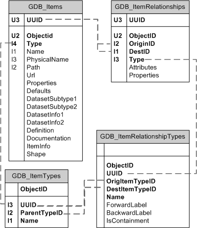

An enterprise geodatabase is made up of system tables, procedures, and functions that are stored in a database management system. The system tables prefixed with GDB_ describe the geodatabase schema that specifies dataset definitions, rules, and relationships. These system tables contain and manage metadata required to implement geodatabase properties, data validation rules, and behaviors. The tables are as follows:

    -   GDB_Items: Contains a list of all items contained within a geodatabase such as feature classes, topologies, and domains
    -   GDB_ItemTypes: Contains a predefined list of recognized item types, such as Table
    -   GDB_ItemRelationships: Contains schema associations between items such as which feature classes are contained within a feature dataset
    -   GDB_ItemRelationshipTypes: Contains a predefined list of recognized relationship types such as DatasetInFeatureDataset

    The GDB_Items and GDB_ItemRelationships tables represent the user-defined schema within a particular geodatabase. The contents of the tables are modified as the schema of the geodatabase is modified. The GDB_ItemTypes and GDB_ItemRelationshipTypes tables are populated when you create the geodatabase and values are static within a software release. The following diagram illustrates the relationships between these four tables:

